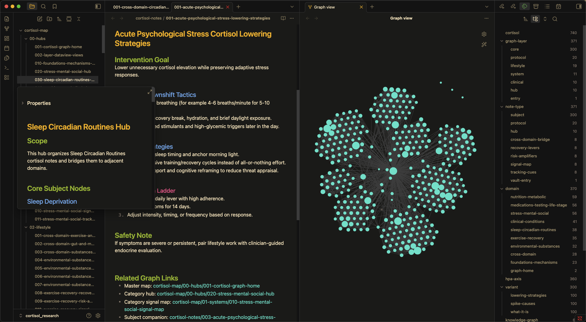

<p align="center">
  
</p>

<p align="center">
  <a href="https://srcery.sh">
    
  </a>
  <a href="https://discord.gg/G6vBMmZ">
    
  </a>
  <a href="https://www.npmjs.com/package/@srcery-colors/srcery-palette">
    
  </a>
</p>

<h2 align="center">Srcery</h2>

<p align="center">
	Srcery is a color scheme with clearly defined contrasting colors and a slightly earthy tone.
</p>


## Requirements
- [Obsidian](https://obsidian.md/) v1.1.9 or above

## Installation

### Manual

1. Clone the repo:
   ```sh
   git clone git@github.com:soykindabored/srcery-obsidian.git
   ```
   Or from the [srcery-colors](https://github.com/srcery-colors/srcery-obsidian) community managed repo:
   ```sh
   git clone git@github.com:srcery-colors/srcery-obsidian.git
   ```

2. Copy `manifest.json` and `theme.css` into your vault's theme directory:
   ```sh
   mkdir -p /path/to/vault/.obsidian/themes/Srcery
   cp manifest.json theme.css /path/to/vault/.obsidian/themes/Srcery/
   ```

   **Or** symlink the files if you want to stay up to date with `git pull`:
   ```sh
   mkdir -p /path/to/vault/.obsidian/themes/Srcery
   ln -s /path/to/srcery-obsidian/{manifest.json,theme.css} /path/to/vault/.obsidian/themes/Srcery/
   ```
   Note that you have to create the `themes/` directory in each vault's `.obsidian/` unless you've already installed a theme from the marketplace.

3. In Obsidian, go to **Settings → Appearance → Themes** and select **Srcery**.

4. Obsidian Community [Download](https://community.obsidian.md/themes/srcery) 

## Srcery Palette

This is the canonical colors for Srcery, a syntax highlighting theme for
various editors and GUIs.

Created using colors that logically adheres to the 16 color base palette of a
terminal, while trying to retain its own identity. The colors are designed to
be easy on the eyes, yet contrast well with the background for long sessions
using an editor or terminal emulator.

Check out [🌐 srcery.sh](https://srcery.sh) and [Github](https://github.com/srcery-colors) for more.


| IMG | NAME | INDEX | HEX | RGB | HSL |
|------|-------|-------|------|-------|------|
|  | black | 0 | `#121110` | `rgb(18, 17, 16)` | `hsl(30, 6%, 7%)` |
|  | red | 1 | `#EF2F27` | `rgb(239, 47, 39)` | `hsl(2, 86%, 55%)` |
|  | green | 2 | `#519F50` | `rgb(81, 159, 80)` | `hsl(119, 33%, 47%)` |
|  | yellow | 3 | `#FBB829` | `rgb(251, 184, 41)` | `hsl(41, 96%, 57%)` |
|  | blue | 4 | `#2C78BF` | `rgb(44, 120, 191)` | `hsl(209, 63%, 46%)` |
|  | magenta | 5 | `#E02C6D` | `rgb(224, 44, 109)` | `hsl(338, 74%, 53%)` |
|  | cyan | 6 | `#0AAEB3` | `rgb(10, 174, 179)` | `hsl(182, 89%, 37%)` |
|  | white | 7 | `#C5B088` | `rgb(197, 176, 136)` | `hsl(39, 34%, 65%)` |
|  | bright_black | 8 | `#917E6B` | `rgb(145, 126, 107)` | `hsl(30, 15%, 49%)` |
|  | bright_red | 9 | `#F75341` | `rgb(247, 83, 65)` | `hsl(6, 92%, 61%)` |
|  | bright_green | 10 | `#98BC37` | `rgb(152, 188, 55)` | `hsl(76, 55%, 48%)` |
|  | bright_yellow | 11 | `#FED06E` | `rgb(254, 208, 110)` | `hsl(41, 99%, 71%)` |
|  | bright_blue | 12 | `#68A8E4` | `rgb(104, 168, 228)` | `hsl(209, 70%, 65%)` |
|  | bright_magenta | 13 | `#FF5C8F` | `rgb(255, 92, 143)` | `hsl(341, 100%, 68%)` |
|  | bright_cyan | 14 | `#2BE4D0` | `rgb(43, 228, 208)` | `hsl(174, 77%, 53%)` |
|  | bright_white | 15 | `#FCE8C3` | `rgb(252, 232, 195)` | `hsl(39, 90%, 88%)` |
|  | dark_green | 22 | `#294229` | `rgb(41, 66, 41)` | `hsl(120, 23%, 21%)` |
|  | dark_red | 88 | `#4F2321` | `rgb(79, 35, 33)` | `hsl(3, 41%, 22%)` |
|  | dark_blue | 24 | `#1E5181` | `rgb(30, 81, 129)` | `hsl(209, 62%, 31%)` |
|  | dim_green | n/a | `#2E5C2E` | `rgb(46, 92, 46)` | `hsl(119, 33%, 27%)` |
|  | orange | 202 | `#FF5F00` | `rgb(255, 95, 0)` | `hsl(22, 100%, 50%)` |
|  | bright_orange | 208 | `#FF8700` | `rgb(255, 135, 0)` | `hsl(32, 100%, 50%)` |
|  | teal | 30 | `#008080` | `rgb(0, 128, 128)` | `hsl(180, 100%, 25%)` |
|  | gray1 | n/a | `#1C1B19` | `rgb(28, 27, 25)` | `hsl(40, 6%, 10%)` |
|  | gray2 | n/a | `#262522` | `rgb(38, 37, 34)` | `hsl(45, 6%, 14%)` |
|  | gray3 | n/a | `#312F2C` | `rgb(49, 47, 44)` | `hsl(36, 5%, 18%)` |
|  | gray4 | n/a | `#3B3935` | `rgb(59, 57, 53)` | `hsl(40, 5%, 22%)` |
|  | gray5 | n/a | `#45433E` | `rgb(69, 67, 62)` | `hsl(43, 5%, 26%)` |
|  | gray6 | n/a | `#504D47` | `rgb(80, 77, 71)` | `hsl(40, 6%, 30%)` |

## Screenshots


